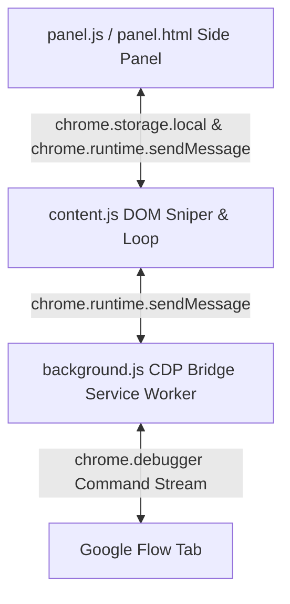

# Flow Auto Prompter 🚀

An elite, Manifest V3, God-Tier Chrome DevTools Protocol (CDP) powered automation engine designed for bulk generating and downloading high-fidelity images on Google Flow (`labs.google/fx/tools/flow`). 

---

## 🚀 1. Project Overview

**Flow Auto Prompter** transforms bulk image creation on Google Flow from a tedious manual process into a hands-free, automated pipeline. Operating as a Chrome extension, it utilizes hardware-level simulation through the Chrome DevTools Protocol (CDP) to interact with Google's React-based Single Page Application (SPA) without invoking security blocks or synthetic event triggers.

### Key Features:
- **Zero Page-Reload Seamless Looping**: Evaluates the queue in-memory, updating state and injecting the next prompt instantly without losing debugger context or reloading the page.
- **CDP Hardware-Level Click & Key Injection**: Simulates native OS mouse clicks (left/right) and key presses, bypassing React/Radix event handlers and Slate.js state synchronization checks.
- **CSS Paint Observation**: Uses fine-tuned visual observers to wait until a generated image resolves to `--blur-amount: 0px` and `opacity: 1` before triggering actions.
- **Aggressive Safety Net**: Continually screens the DOM for warning indicators, rate limits, and 403 Forbidden scenarios to execute an emergency brake.

---

## 🏗️ 2. Architecture & Core Components

The extension is structured around a three-pillar system under Manifest V3:

### The Three Pillars:
1. **`background.js` (The CDP Bridge)**: The service worker acts as a controller for Chrome's native debugger. It manages session attachment/detachment, handles keyboard input injections, and dispatches precise mouse coordinates (including right-clicks) directly to the browser window.
2. **`content.js` (DOM Sniper & State Machine)**: Running in the context of the page, this script coordinates the automation stages. It handles configuration lookup, XPath matching, tile counting, CSS paint checking, context menu invocation, and queue management.
3. **`panel.html` & `panel.js` (Side Panel UI & Storage Manager)**: Provides a dark-mode side panel for entering queues, monitoring completion/failure stats in real-time, configuring pacing intervals, and saving settings to `chrome.storage.local` across browser sessions.

---

## 🛡️ 3. Development Audit & Bug Log (The Journey)

Overcoming React's synthetic event wrapper, Slate.js editors, and Radix UI portals required highly creative engineering. Here is our dev audit log:

### 🐛 Bug 1: React `getSelection()` Null Errors & Event Blocking
- **Symptom**: Standard DOM `.click()` and `Event` dispatches on dropdown triggers failed silently or triggered React rendering errors.
- **Solution**: Developed a Manifest V3 debugger bridge in `background.js` that calls `Input.dispatchMouseEvent` via Chrome DevTools Protocol, simulating hardware-level mouse actions that React cannot block.

### 🐛 Bug 2: Slate.js Aggressive Input Rejection
- **Symptom**: Injecting prompt text via `element.innerText` was immediately discarded by Google Flow's Slate.js-based editor when clicking submit, resulting in empty generation prompts.
- **Solution**: Engineered a robust **Verify & Retry** injection loop. The engine scrolls the editor into view, simulates focus via CDP, clears previous content with `document.execCommand('delete')`, fires `document.execCommand('insertText')`, sends a fallback `Input.insertText` command via CDP, and retries up to 5 times until the DOM content is verified.

### 🐛 Bug 3: Radix UI Hidden Elements & (0,0) Coordinate Clicks
- **Symptom**: Radix UI overlays portal elements into a separate node tree. Standard XPaths returned hidden, detached, or zero-dimension items, leading to CDP clicks firing at coordinate `(0,0)`.
- **Solution**: Created a helper function `findVisibleElement` that traverses matched XPath nodes, measures their physical layout using `getBoundingClientRect()`, and ensures click actions only fire when an element has positive width/height and viewport visibility.

### 🐛 Bug 4: Premature Downloads (Race Conditions)
- **Symptom**: Percentage text indicators (e.g. `45%`) flicker in React, causing false-positive completion signals and triggering downloads before rendering finished.
- **Solution**: Replaced post-submit polling with a 2-stage visual observer:
  - **Stage 1 (Tile Counting)**: Right before clicking submit, the current number of generated images is recorded using `count(//img[@alt='Generated image'])`. The script halts until the image count strictly increases.
  - **Stage 2 (CSS Paint Verification)**: Waits until the newly created card is fully loaded (`--blur-amount: 0px` and `opacity: 1`) and checks that no percentage elements containing `%` exist on the page.

### 🐛 Bug 5: Nested Download Menu Isolation
- **Symptom**: The download menu button inside the card is hidden behind hover states, making it difficult to target reliably.
- **Solution**: Bypassed the menu button entirely by updating `background.js` to support right-click dispatches. The extension right-clicks the generated `` element directly (`cdpRightClick`), opening the Radix context menu immediately to click "Download" and select the "1K Original size" sub-option.

---

## 🚦 4. Google Server Rate Limiting & Safety

To protect user accounts from rate limits and automated activity bans:

- **The Emergency Brake**: During Stage 1, the script scans the page for warning messages (e.g. *"unusual activity"* or *"reached the limit"*). If a warning toast appears, it throws a `CRITICAL_ACCOUNT_BLOCK` exception, cancels the debugger attachment, and stops the UI loop completely without reloading or advancing prompts.
- **Randomized Humanizer Delay**: Success iterations calculate pacing delays by taking the base user-configured `restDelay` and appending a randomized variance of `0` to `5` seconds. This introduces irregular gaps between generations, breaking patterns that look like bots.

---

## 🔮 5. Future Roadmap & Synchronizations

To elevate Flow Auto Prompter even further:
- **Auto-Resume Cooldowns**: Integrate session saving to persist state, permitting auto-resume after a 24-hour sleep window if a server-side rate limit is reached.
- **Profile Rotation**: Implement an API to swap Chrome profile cookies dynamically, switching accounts when a rate limit is detected.
- **DOM Selector Resilience**: Deploy a fuzzy locator system or remote JSON config to update XPaths without manual extension updates in case Google edits Flow's layout classes.

---

## 📥 6. Installation & Usage

1. Clone or download this repository to your local drive.
2. Open Chrome/Brave and navigate to `chrome://extensions/`.
3. Enable **Developer mode** in the top right.
4. Click **Load unpacked** in the top left and select this extension's directory.
5. Open Google Flow at `labs.google/fx/tools/flow`.
6. Click the extension icon to slide open the side panel, load your prompts, configure your rest pacing, and click **Start Automation**.

> [!WARNING]
> **CDP Debugging Banner**: A yellow warning banner stating `"Flow Auto Prompter started debugging this browser"` will appear at the top of the browser tab. This is a native Chrome security warning indicating that DevTools commands are running. **Do not click 'Cancel'**, as closing this banner will detach the debugger and stop the automation process.
